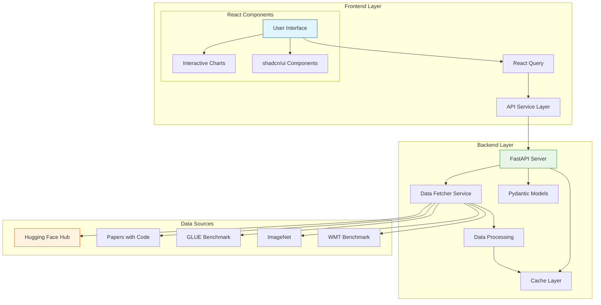

# ML Benchmark Dashboard 🚀

A comprehensive, full-stack application for visualizing and analyzing machine learning benchmark data with real-world insights. Built with FastAPI backend and React frontend, featuring 8+ interactive charts powered by Plotly.js.

## 🏗️ Architecture



### Architecture Components

#### Frontend Layer
- **User Interface**: React-based UI with TypeScript for type safety
- **React Components**:
  - **Interactive Charts**: 8+ Plotly.js visualizations for ML metrics
  - **shadcn/ui Components**: Beautiful, accessible UI elements
- **React Query**: Intelligent data fetching, caching, and state management
- **API Service Layer**: Handles communication with backend

#### Backend Layer
- **FastAPI Server**: High-performance Python web framework
- **Data Fetcher Service**: Orchestrates data collection from multiple sources
- **Cache Layer**: Intelligent caching with configurable TTL
- **Pydantic Models**: Type-safe data validation and serialization
- **Data Processing**: Data normalization, analysis, and transformation

#### Data Sources
- **Hugging Face Hub**: Primary source for model metadata and metrics
- **Papers with Code**: Real-world benchmark results and leaderboards
- **GLUE Benchmark**: NLP task performance metrics
- **ImageNet**: Computer vision model benchmarks
- **WMT Benchmark**: Machine translation performance data

### Data Flow
1. Frontend makes requests through React Query
2. API Service Layer handles backend communication
3. FastAPI processes requests and checks cache
4. Data Fetcher collects data from multiple sources
5. Processing layer normalizes and analyzes data
6. Cache stores processed data for future requests
7. Frontend receives data and updates visualizations


## ✨ Features

### 🎯 Core Functionality
- **Real-time Data Fetching**: Pulls ML benchmark data from Hugging Face Hub API
- **Comprehensive Analytics**: 8+ interactive visualization charts
- **Smart Caching**: Intelligent data caching with configurable TTL
- **Responsive Design**: Mobile-first UI with shadcn/ui components
- **Type Safety**: Full TypeScript implementation with strict typing

### 📊 Visualization Charts
1. **Performance Bar Chart** - Top performing models comparison
2. **Trend Line Chart** - Performance evolution over time
3. **Parameter Efficiency Scatter** - Model size vs accuracy analysis
4. **Correlation Heatmap** - Metric relationships visualization
5. **Dataset Popularity Chart** - Most used benchmarking datasets
6. **Model Family Radar Chart** - Multi-dimensional family comparison
7. **Task Breakdown Chart** - AI task distribution (sunburst/pie/donut)
8. **Leaderboard Tables** - Top performing models with efficiency scores

### 🔧 Technical Features
- **Data Sources**: Hugging Face Hub, synthetic benchmarks, and extensible API design
- **Real-time Updates**: Auto-refresh capabilities with background sync
- **Export Functionality**: Download charts as PNG/SVG and data as CSV/JSON
- **Advanced Filtering**: Filter by task type, model family, datasets, and search
- **Performance Optimized**: Lazy loading, query caching, and efficient rendering

## 🏗️ Architecture

```
metriqai/
├── backend/                 # FastAPI Python backend
│   ├── main.py             # FastAPI application entry point
│   ├── models.py           # Pydantic data models
│   ├── data_fetcher.py     # Data fetching and processing logic
│   ├── requirements.txt    # Python dependencies
│   └── run.py             # Development server runner
└── frontend/              # React TypeScript frontend
    ├── src/
    │   ├── components/    # React components
    │   │   ├── ui/       # shadcn/ui components
    │   │   └── charts/   # Chart components
    │   ├── hooks/        # Custom React hooks
    │   ├── services/     # API service layer
    │   ├── types/        # TypeScript type definitions
    │   └── lib/          # Utility functions
    ├── package.json      # Node.js dependencies
    └── vite.config.ts    # Vite configuration
```

## 🚀 Quick Start

### Prerequisites
- **Python 3.8+** (for backend)
- **Node.js 18+** (for frontend)
- **Git** (for cloning)

### 1. Clone the Repository
```bash
git clone https://github.com/your-username/metriqai.git
cd metriqai
```

### 2. Backend Setup (FastAPI)

```bash
cd backend

# Create virtual environment
python -m venv venv
source venv/bin/activate  # On Windows: venv\Scripts\activate

# Install dependencies
pip install -r requirements.txt

# Start the development server
python run.py
```

The backend will be available at `http://localhost:8000`

**API Documentation**: Visit `http://localhost:8000/docs` for interactive Swagger docs

### 3. Frontend Setup (React + TypeScript)

```bash
cd ../frontend

# Install dependencies
npm install

# Start the development server
npm run dev
```

The frontend will be available at `http://localhost:3000`

### 4. Access the Dashboard

Open your browser and navigate to `http://localhost:3000` to view the ML Benchmark Dashboard.

## 📊 Data Sources

The application intelligently fetches data from multiple sources:

1. **Hugging Face Hub API** (Primary)
   - Model metadata and performance metrics
   - Download statistics and popularity metrics
   - Real model evaluation results

2. **Synthetic Benchmark Data** (Fallback)
   - Generated realistic performance ranges
   - Covers gaps in real data
   - Ensures comprehensive visualization

3. **Extensible API Design**
   - Easy integration with additional sources
   - Support for OpenML, Papers with Code, and custom datasets

## 🎨 UI Components

Built with modern UI components:
- **shadcn/ui**: Accessible, customizable components
- **Tailwind CSS**: Utility-first styling
- **Lucide React**: Beautiful icons
- **Plotly.js**: Interactive, publication-quality charts

## 📈 Chart Types & Insights

### Performance Analysis
- **Bar Charts**: Model rankings and comparisons
- **Scatter Plots**: Parameter efficiency analysis
- **Line Charts**: Performance trends over time

### Data Exploration
- **Heatmaps**: Metric correlation analysis
- **Radar Charts**: Multi-dimensional model family comparison
- **Sunburst/Pie Charts**: Task and dataset distribution

### Advanced Features
- **Interactive Tooltips**: Detailed hover information
- **Zoom & Pan**: Explore data in detail
- **Export Options**: Save charts and data
- **Responsive Design**: Works on all screen sizes

## 🔧 Configuration

### Backend Configuration
```python
# Environment variables
HOST=0.0.0.0
PORT=8000
RELOAD=true
WORKERS=1

# Data fetching settings
MAX_MODELS_PER_TASK=50
CACHE_TTL_MINUTES=60
```

### Frontend Configuration
```bash
# .env file
VITE_API_BASE_URL=http://localhost:8000
VITE_ENABLE_DEV_TOOLS=true
VITE_AUTO_REFRESH_INTERVAL=300000
```

## 📝 API Endpoints

### Core Endpoints
- `GET /` - API information
- `GET /health` - Health check
- `GET /api/benchmarks` - Get benchmark data
- `POST /api/refresh` - Trigger data refresh
- `GET /api/cache-status` - Cache status information

### Response Format
```json
{
  "data": [...],           // Benchmark entries
  "summary": {...},        // Statistical summary
  "correlations": [...],   // Metric correlations
  "leaderboards": [...]    // Top model rankings
}
```

## 🧪 Development

### Backend Development
```bash
cd backend

# Run with auto-reload
python run.py

# Run tests (if implemented)
pytest

# Format code
black .
```

### Frontend Development
```bash
cd frontend

# Development server with HMR
npm run dev

# Build for production
npm run build

# Preview production build
npm run preview

# Type checking
npm run tsc

# Linting
npm run lint
```

### Adding New Charts
1. Create component in `frontend/src/components/charts/`
2. Implement chart logic with Plotly.js
3. Add to Dashboard component
4. Export data processing utilities

## 📦 Production Deployment

### Backend (FastAPI)
```bash
# Using uvicorn directly
uvicorn main:app --host 0.0.0.0 --port 8000 --workers 4

# Using gunicorn + uvicorn workers
gunicorn main:app -w 4 -k uvicorn.workers.UvicornWorker
```

### Frontend (React)
```bash
# Build for production
npm run build

# Serve with nginx, apache, or any static server
# Built files are in ./dist/
```

### Docker Deployment (Optional)
```bash
# Build backend image
docker build -t ml-benchmark-backend ./backend

# Build frontend image
docker build -t ml-benchmark-frontend ./frontend

# Run with docker-compose
docker-compose up -d
```

## 🤝 Contributing

We welcome contributions! Please see our [Contributing Guidelines](CONTRIBUTING.md) for details.

1. Fork the repository
2. Create a feature branch (`git checkout -b feature/amazing-feature`)
3. Commit your changes (`git commit -m 'Add amazing feature'`)
4. Push to the branch (`git push origin feature/amazing-feature`)
5. Open a Pull Request

## 📄 License

This project is licensed under the MIT License - see the [LICENSE](LICENSE) file for details.

## 🙏 Acknowledgments

- **Hugging Face** for providing the Hub API
- **Plotly.js** for excellent charting capabilities
- **shadcn/ui** for beautiful, accessible components
- **FastAPI** and **React** communities for amazing frameworks

## 📞 Support

- 📧 **Email**: support@mlbenchmark.com
- 🐛 **Issues**: [GitHub Issues](https://github.com/your-username/metriqai/issues)
- 💬 **Discussions**: [GitHub Discussions](https://github.com/your-username/metriqai/discussions)

## 🔮 Roadmap

- [ ] Additional data sources (OpenML, Papers with Code)
- [ ] User authentication and saved views
- [ ] Custom benchmark upload
- [ ] Advanced filtering and search
- [ ] Model comparison tools
- [ ] API rate limiting and authentication
- [ ] Mobile app version

---

**Built with ❤️ for the ML community**

[](https://github.com/your-username/metriqai)
[](https://github.com/your-username/metriqai/fork)